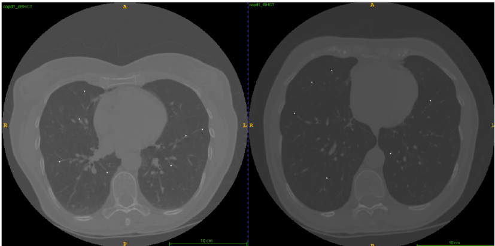

# Lung-CT-Registration-Challenge

This repository provides a pipeline for non-rigid lung CT image registration, including anatomical landmark transformation and lung segmentation. The main goal is to accurately align inhale and exhale CT images and evaluate registration accuracy using the Target Registration Error (TRE) metric. This was the final assignment for the Medical Image Registration and Analysis course at the University of Girona, as part of the [MAIA programme](https://maiamaster.udg.edu/).

||
| :--: | 
| *Example of images overlaid with their corresponding landmarks. The left image shows the inhale phase, while the right image shows the exhale phase.* |

## Overview

Lung CT image registration is a crucial task in medical imaging, particularly for applications such as disease progression analysis, radiation therapy planning, and functional imaging. This project implements a complete workflow to:

- Perform non-rigid image registration between inhale and exhale CT images.
- Transform anatomical landmarks to match the registered images.
- Generate segmentation masks for the lung regions.
- Compute the TRE to evaluate registration accuracy.

## Repository Structure

Lung-CT-Registration-Challengeç

   |─ README.md                   -> Documentation for the project
   
   |─ .gitignore                  -> Ignore unnecessary files in version control
   
   |─ orchestator_challenge.ipynb -> Jupyter Notebook orchestrating the entire process
   
   |─ Create_mask.py              -> Script for generating segmentation masks
   
   |─ a_registration.py           -> Module for non-rigid registration of lung CT images
   
   |─ b_points.py                 -> Module for landmark transformation and processing
   
   |─ c_TRE.py                    -> Module for computation of Target Registration Error (TRE)

   |- Parameters_BSpline_final.txt-> File with the final parameters used for registration

## Getting Started

### Prerequisites

Ensure you have the following dependencies installed:

pip install numpy scipy SimpleITK nibabel matplotlib

### Usage

1. Run the Orchestrator Notebook  
   The Jupyter Notebook `orchestator_challenge.ipynb` is the main entry point and runs the full registration workflow. Open it and execute each cell step by step. Ensure that the file names in each of the modules correspond to the files you have on your local machine. 

2. Run Individual Scripts  
   If you prefer to execute the scripts separately, follow this order:

   - Registration  
     python a_registration.py  
     This script performs non-rigid registration to align inhale and exhale CT images.

   - Landmark Processing  
     python b_points.py  
     Transforms anatomical landmarks to align with the registered images.

   - Mask Generation  
     python Create_mask.py  
     Generates lung segmentation masks.

   - TRE Computation  
     python c_TRE.py  
     Evaluates registration accuracy using Target Registration Error.

## Evaluation Metrics

The primary metric used to assess registration performance is the Target Registration Error (TRE), which quantifies the misalignment of corresponding anatomical landmarks before and after registration.

## Notes

- Ensure that input CT images are properly formatted and correctly preprocessed before running the registration process.
- Parameter tuning may be required depending on dataset variations.

